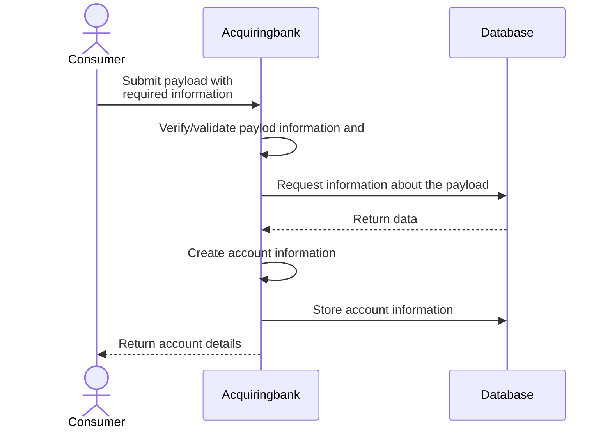
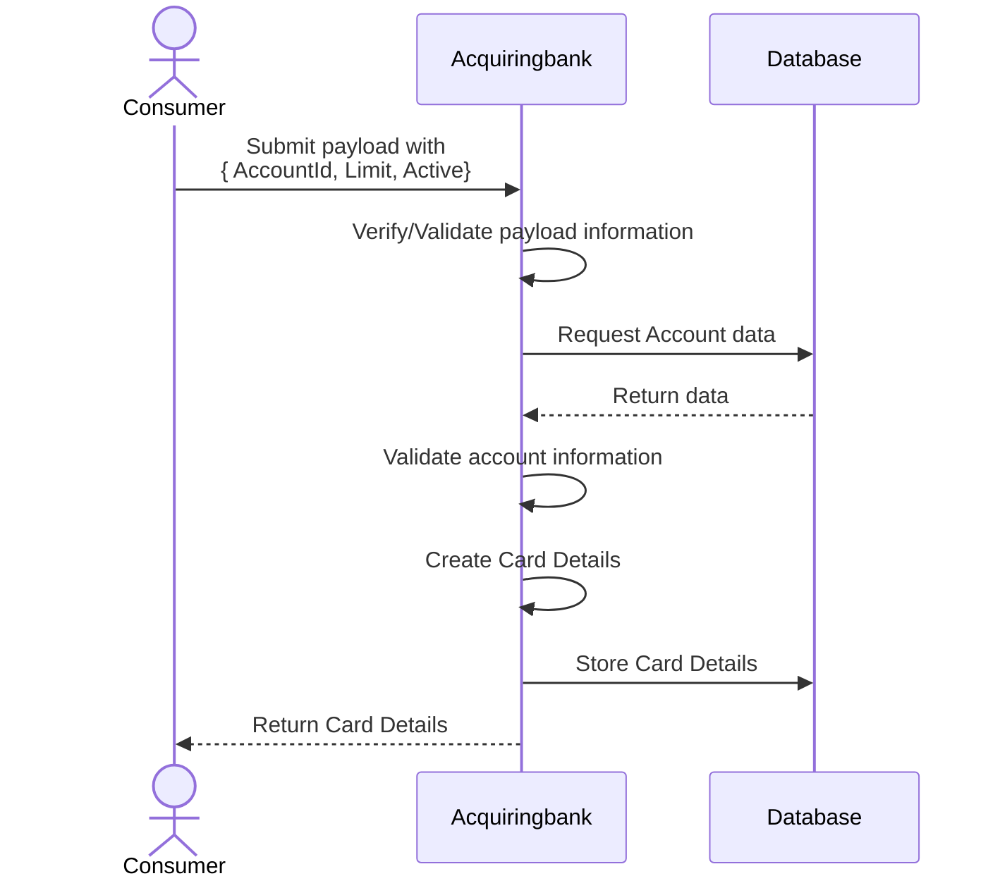
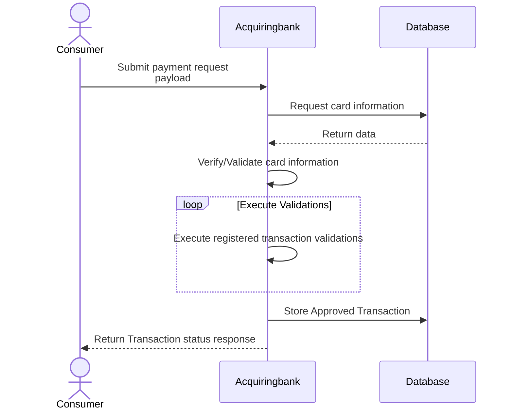

# Acquiring Bank Simulator

The **Acquiring Bank Simulator** is designed to simulate an Acquiring Bank's functionality in processing payments through a Payment Gateway. This simulator is capable of performing the following actions:

- Creating accounts for specified clients.
- Assigning cards to specific accounts.
- Processing payment transactions for previously created cards.

## Running the Application

This application is containerized, making it straightforward to run using Docker. You have two options to run the application: building the Docker image directly or using Docker Compose.

### Option 1: Building and Running Manually

To build the Docker image manually, navigate to the root folder of the solution in your terminal and execute the following commands:

```sh
docker build -t icaropy/acquiring-bank-simulator -f ./deploy/Dockerfile .
```

Once the build is complete, you can run the container using the following command:

```sh
docker run -p 5005:80 --name acquiring-bank-simulator -d \
  -e Storage__MongoDb__Host=mongodb \
  -e Storage__MongoDb__Port=27017 \
  -e Storage__MongoDb__UserName=admin \
  -e Storage__MongoDb__Password=admin \
  -e Storage__MongoDb__Database=AcquiringBank \
  icaropy/acquiring-bank-simulator
```

Please note that this application relies on MongoDB, so ensure you have a MongoDB instance running before starting the simulator.

### Option 2: Using Docker Compose

For a simpler setup, navigate to the ./deploy folder in your terminal and execute:

```sh
   docker-compose up -d
```

This command will automatically build and start the necessary services, including the Acquiring Bank Simulator and MongoDB, based on the configuration in the docker-compose.yml file.

### Testing the Application

To test the functionality of the Acquiring Bank Simulator, you can use the popular API testing tool  [insomnia](https://insomnia.rest/). A collection of API endpoints for testing the simulator is provided within the solution's folder.
Download and install Insomnia if you haven't already, then import the provided collection file. This collection includes pre-configured API requests that you can use to interact with the Acquiring Bank Simulator.
Feel free to explore the simulator's capabilities and experiment with different scenarios using the imported collection in Insomnia.

## Structure

<details>

```sh
├── AcquiringBank.sln
├── AcquiringBank.sln.DotSettings.user
├── readme.md
├── src
│   ├── Application.Services
│   │   ├── Abstractions
│   │   │   ├── IAccountService.cs
│   │   │   ├── ICardService.cs
│   │   │   └── IPaymentService.cs
│   │   ├── AccountService.cs
│   │   ├── Application.Services.csproj
│   │   ├── CardService.cs
│   │   ├── Exceptions
│   │   │   ├── CardNotFoundException.cs
│   │   │   ├── InvalidClientAccountException.cs
│   │   │   └── InvalidLimitValueException.cs
│   │   ├── Mappers
│   │   │   ├── AccountMapperExtension.cs
│   │   │   ├── CardMapperExtension.cs
│   │   │   └── PaymentTransactionMapperExtension.cs
│   │   ├── PaymentService.cs
│   │   └── Validators
│   │       ├── CardHasEnoughLimitValidator.cs
│   │       ├── CardIsActiveValidator.cs
│   │       ├── CardIsExpiredValidator.cs
│   │       └── IPaymentTransactionValidator.cs
│   ├── Data.Models
│   │   ├── Account
│   │   │   └── AccountModel.cs
│   │   ├── Card
│   │   │   └── CardModel.cs
│   │   ├── Data.Models.csproj
│   │   ├── ModelBase.cs
│   │   └── Payment
│   │       └── TransactionModel.cs
│   ├── Data.Repositories
│   │   ├── Abstractions
│   │   │   ├── BaseRepository.cs
│   │   │   ├── IAccountRepository.cs
│   │   │   ├── IBaseRepository.cs
│   │   │   ├── ICardRepository.cs
│   │   │   └── ITransactionRepository.cs
│   │   ├── AccountRepository.cs
│   │   ├── CardRepository.cs
│   │   ├── Data.Repositories.csproj
│   │   └── TransactionRepository.cs
│   ├── Domain.Models
│   │   ├── Account
│   │   │   ├── AccountDto.cs
│   │   │   ├── CreateAccountRequest.cs
│   │   │   └── CreateAccountResponse.cs
│   │   ├── Card
│   │   │   ├── CardDto.cs
│   │   │   ├── CreateCardRequest.cs
│   │   │   └── UpdateCardRequest.cs
│   │   ├── Domain.Models.csproj
│   │   ├── Pagination
│   │   │   ├── IPagedResponse.cs
│   │   │   └── PagedResponse.cs
│   │   └── Payment
│   │       ├── PaymentTransactionRequest.cs
│   │       ├── PaymentTransactionResponse.cs
│   │       └── Transaction
│   │           ├── CardDetailsDto.cs
│   │           └── TransactionDetailsDto.cs
│   ├── Infrastructure.CrossCutting
│   │   ├── Configuration
│   │   │   ├── MongoDbSettings.cs
│   │   │   └── StorageSettings.cs
│   │   ├── Extensions
│   │   │   ├── MongoDbExtensions.cs
│   │   │   ├── RepositoriesExtensions.cs
│   │   │   └── ServicesExtensions.cs
│   │   └── Infrastructure.CrossCutting.csproj
│   └── Presentation.Api
│       ├── appsettings.json
│       ├── Controllers
│       │   ├── AccountController.cs
│       │   ├── CardController.cs
│       │   └── PaymentController.cs
│       ├── Presentation.Api.csproj
│       ├── Program.cs
│       └── Properties
│           └── launchSettings.json
└── test
    ├── Application.Services.IntegrationTests
    │   ├── AccountServiceIntegrationTests.cs
    │   ├── Application.Services.IntegrationTests.csproj
    │   ├── CardServiceIntegrationTests.cs
    │   ├── Fixtures
    │   │   └── MongoDbFixture.cs
    │   └── PaymentServiceIntegrationTests.cs
    └── Application.Services.UnitTests
        ├── Application.Services.UnitTests.csproj
        ├── CardHasEnoughLimitValidatorUnitTests.cs
        └── CardIsExpiredValidatorUnitTests.cs

```

</details>

## Contract Details

To view comprehensive contract details and interact with the APIs, you can access the Swagger documentation by running the application in debug mode and navigating to: `{service_url}/swagger/index.html`.

### Account

The **Accounts** functionality allows you to manage client accounts within the Acquiring Bank Simulator. This section provides details about the contracts and API endpoints associated with creating accounts.

#### Create Account Request

Use the following cURL command to create a new account for a client:

```sh
curl -X 'POST' \
  'http://localhost:5000/api/Account/v1' \
  -H 'accept: */*' \
  -H 'Content-Type: application/json' \
  -d '{
  "clientName": "Mingau"
}'
```

Create Account Response

Upon successful creation of an account, the response will include the following JSON structure:

```json
{
  "clientId": "f72f33ef-d35c-4ba1-a951-ce1a772bd784",
  "accountId": "95307dab-77b9-40d3-879c-3ef166f25ee5"
}
```

#### Usage

* Use the provided cURL command to make a POST request and create a new account.
* The clientName parameter specifies the name of the client associated with the account.
* The response will include the clientId and accountId identifiers for the newly created account.

### Card

The **Cards** functionality allows you to manage cards associated with client accounts within the Acquiring Bank Simulator. This section provides details about the contracts and API endpoints associated with creating cards.

#### Create Card Request

Use the following cURL command to create a new card associated with a client's account:

```sh
curl -X 'POST' \
  'http://localhost:5000/api/Card/v1' \
  -H 'accept: */*' \
  -H 'Content-Type: application/json' \
  -d '{
  "accountId": "95307dab-77b9-40d3-879c-3ef166f25ee5",
  "limit": 1000,
  "active": true
}'
```

Create Card Response

Upon successful creation of a card, the response will include the following JSON structure:

#### Create Card Response

```json
{
  "id": "41f98749-e18d-41d1-9a9b-1ffc8f384d66",
  "clientName": "Mingau",
  "number": "3528-8483-2421-1175",
  "verificationValue": "829",
  "expiresAt": {
    "year": 2024,
    "month": 10
  },
  "limit": 1000,
  "friendlyName": "Food",
  "isActive": true
}
```

#### Usage

* Use the provided cURL command to make a POST request and create a new card associated with a client's account.
* The accountId parameter specifies the identifier of the client's account to which the card will be linked.
* Set the limit parameter to define the credit limit for the card.
* Use the active parameter to specify whether the card is active or not.

### Payment/Transactions

The **Payments/Transactions** functionality enables you to simulate payment transactions through the Acquiring Bank Simulator. This section provides details about the contracts and API endpoints for submitting payment transactions.

### Submiting a valid payment transaction

Use the following cURL command to submit a valid payment transaction:

```sh
curl -X 'POST' \
  'http://localhost:5000/api/Payment/v1' \
  -H 'accept: */*' \
  -H 'Content-Type: application/json' \
  -d '{
  "cardDetails": {
    "number": "3528-8483-2421-1175",
    "verificationValue": "829",
    "expiresAt": {
      "month": 10,
      "year": 2024
    }
  },
  "details": {
    "amount": 100,
    "currency": "EUR",
    "merchant": "Dunkin Donuts",
    "submittedAt": "2022-06-27T16:01:02.289Z"
  }
}'
```

Upon successful submission of a valid payment transaction, the response will return a 201 Created status with a body of true.

### Submiting an ivalid payment transaction

To simulate submitting an invalid payment transaction, use the following cURL command:

```sh
curl -X 'POST' \
  'http://localhost:5000/api/Payment/v1' \
  -H 'accept: */*' \
  -H 'Content-Type: application/json' \
  -d '{
  "cardDetails": {
    "number": "3528-8483-2421-1175",
    "verificationValue": "829",
    "expiresAt": {
      "month": 10,
      "year": 2024
    }
  },
  "details": {
    "amount": 1200,
    "currency": "EUR",
    "merchant": "Dunkin Donuts",
    "submittedAt": "2022-06-27T16:01:02.289Z"
  }
}'
```

In case of an invalid payment transaction submission, the response will return a 400 Bad Request status along with a detailed JSON response indicating the reason for failure:

```json
[
  {
    "success": false,
    "message": "Card has no limit to approve this transaction!"
  }
]

```

#### Usage

* Use the provided cURL commands to simulate submitting payment transactions.
* Provide the necessary card details, including card number, verification value, and expiration date.
* Specify the payment details, including amount, currency, merchant, and submission timestamp.
* Observe the returned response and status code to determine the success or failure of the transaction.

## Payment Transaction Validators

# Payment Transaction Validators

The Acquiring Bank Simulator provides an easily extendable and adaptable framework for payment transaction validation. New validation rules can be effortlessly added by creating new classes that implement the `IPaymentTransactionValidator` interface. This mechanism enables the application to dynamically discover and integrate additional validators during its setup.

### Adding New Validation Rules

1. Create a new class that implements the `IPaymentTransactionValidator` interface. This interface defines the necessary methods to perform payment transaction validation.
2. Implement the validation logic within the methods defined by the interface. You can define various validation checks based on your specific requirements.
3. During the application's setup process, the system will automatically identify and load all payment transaction validator classes.

### Example

Suppose you want to add a new validation rule to ensure that a payment transaction amount is within a certain range. You can follow these steps:

1. Create a new class that implements the `IPaymentTransactionValidator` interface, e.g., `AmountRangeValidator`.
2. Implement the validation logic within the `Validate` method of the `AmountRangeValidator` class to verify if the transaction amount falls within the desired range.
3. Upon application startup, the framework will identify the `AmountRangeValidator` class and integrate it into the validation process.

### Directory Structure

For more guidance and examples, refer to the `src/AcquiringBank.Application/Services/Validators` directory. This directory contains existing validator classes and serves as a reference for creating your own custom validators.

### Benefits of Extensibility

The flexible payment transaction validation system allows the Acquiring Bank Simulator to evolve with changing requirements. By simply adding new validator classes, you can enforce diverse transaction rules without modifying existing code, promoting modularity and maintainability.
Feel free to explore and contribute to the **Payment Transaction Validators** to enhance the validation capabilities of the Acquiring Bank Simulator.


## Sequence diagrams

### create account

#### The following diagram illustrates the process of creating a new account for a client:



### create card

#### The following diagram illustrates the process of creating a new card for an existing account:



### Process Payment Transaction

#### The following diagram illustrates the process of processing a payment transaction:



## External dependencies

At this moment, this application rely only on [MongoDb](https://www.mongodb.com/) as it is the main storage of this
application.

## Variables/Docker Env

The application need to be configured with some variables, as follows

| Variable Name            | Value                 | Type    |
|--------------------------|-----------------------|---------|
| Storage:MongoDb:Host     | localhost / 127.0.0.1 | string  |
| Storage:MongoDb:Port     | 27017                 | integer |
| Storage:MongoDb:UserName | admin                 | string  |
| Storage:MongoDb:Password | admin                 | string  |
| Storage:MongoDb:Database | AcquiringBank         | string  |
